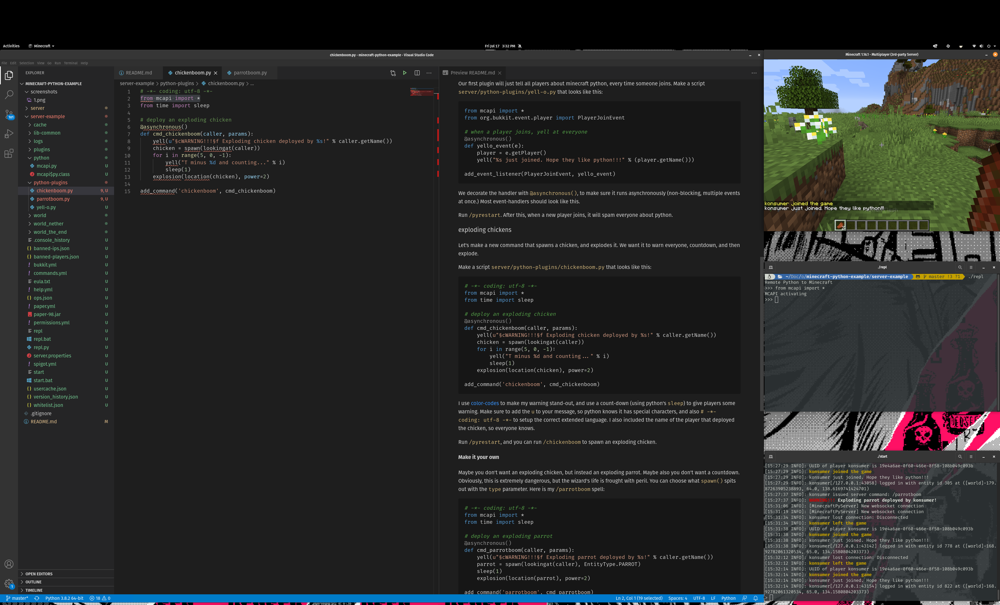

# minecraft python server example

This will walk you through setting up a minecraft server that can be extended with python & writing some plugins. It uses [minecraft-python](https://github.com/Macuyiko/minecraft-python) to make things more fun & easy than writing plugins directly in java.



## server

First, we need to setup a server:

* Install [java](https://www.java.com/ES/download/) on your system
* Install a text-editor. I like [VSCode](https://code.visualstudio.com/). I also like to install `Python` and `Python Indent` extensions.
* Make a directory called `server/`
* Download [paper](https://papermc.io/downloads) (choose latest version) and save it in `server/`
* Copy files in `server/` from this repo to your `server/` dir
* Open a cmd-shell (windows) or terminal in `server/`. Run `./start` to start the server once, and edit eula.txt to accept it.
* Download the latest [minecraft python.jar](https://github.com/Macuyiko/minecraft-python/releases) and put it in `server/plugins`
* Run `./start` again, and then `op` yourself in the minecraft-terminal, so you can run everything.

If you are using [VSCode](https://code.visualstudio.com/), you can open the built-in terminal (with `Ctrl-Backtick`), and run these directly.

### REPL

There is a [python REPL](https://mcpyrepl.surge.sh) available for the server running on localhost, so you can try stuff out, and explore the available APIs. Even through it's a remote website, nothing is sent to the remote server, and it communicates directly with your local python plugin.

### file-locations

* `server/python-plugins` - put your plugins here
* `server/python` - put your shared library files here, so you can share code between different plugins. Minecraft python makes a script called `mcapi.py`, which you should have a look at (see the stuff below `Built-in helper functions`) that gives you some utilities for your plugins, but you can add whatever you want in this dir, and use it in your plugins.

## plugins

Your first goto-reference for how to do things should be the [Bukkit API docs](https://hub.spigotmc.org/javadocs/bukkit/index.html). The python API mostly follows java-bukkit, but sometimes there are little things you have to do, to work around jython-binding complexity. You can see some examples of this, if you look at `server/python/mcapi.py`.

### yell-o world

Our first plugin will just tell all players about minecraft python, every time someone joins. Make a script `server/python-plugins/yell-o.py` that looks like this:

```python
from mcapi import *
from org.bukkit.event.player import PlayerJoinEvent

# when a player joins, yell at everyone
@asynchronous()
def yello_event(e):
    player = e.getPlayer()
    yell("%s just joined. Hope they like python!!!" % (player.getName()))

add_event_listener(PlayerJoinEvent, yello_event)
```

We decorate the handler with `@asynchronous()`, to make sure it runs asynchronously (non-blocking, multiple events at once.) Most event-handlers should look like this.

Run `/reload confirm`. After this, when a new player joins, it will spam everyone about python. 


### exploding chickens

Let's make a new command that spawns a chicken, and explodes it. We want it to warn everyone, countdown, and then explode.

Make a script `server/python-plugins/chickenboom.py` that looks like this:

```python
# -*- coding: utf-8 -*-
from mcapi import *
from time import sleep

# deploy an exploding chicken
@asynchronous()
def cmd_chickenboom(caller, params):
    yell(u"§cWARNING!!!§f Exploding chicken deployed by %s!" % caller.getName())
    chicken = spawn(lookingat(caller))
    for i in range(5, 0, -1):
        yell("T minus %d and counting..." % i)
        sleep(1)
    explosion(location(chicken), power=2)

add_command('chickenboom', cmd_chickenboom)
```

I use [color-codes](https://www.digminecraft.com/lists/color_list_pc.php) to make my warning stand-out, and use a count-down (using python's `sleep`) to give players some warning. Make sure to add the `u` to your message, so python knows it has special characters, and also `# -*- coding: utf-8 -*-` to setup the correct extended language for the file. I also included the name of the player that deployed the chicken, so everyone knows.

Run `/reload confirm`, and you can run `/chickenboom` to spawn an exploding chicken.

#### Make it your own

Maybe you don't want an exploding chicken, but instead an exploding parrot. Maybe also you don't want a countdown. Obviously, this is extremely dangerous, but the wizard's life is frought with peril. You can choose what `spawn()` spits out with the `type` parameter. Here is my `/parrotboom` spell:

```python
# -*- coding: utf-8 -*-
from mcapi import *
from time import sleep

# deploy an exploding parrot
@asynchronous()
def cmd_parrotboom(caller, params):
    yell(u"§cWARNING!!!§f Exploding parrot deployed by %s!" % caller.getName())
    parrot = spawn(lookingat(caller), EntityType.PARROT)
    sleep(1)
    explosion(location(parrot), power=2)

add_command('parrotboom', cmd_parrotboom)
```

I added a `sleep` for 1 second, just so the newly-created parrot has a second to contemplate their existance, before being turned into a bomb.

You can use the [python REPL](https://mcpyrepl.surge.sh) to discover other `EntityType`s:

```python
from mcapi import *
dir(EntityType)
```


### lightning blocks

Let's make it so whenever a player breaks a block, lightning strikes. Make a file called `server/python-plugins/lightningblock.py`

```python
from mcapi import *
from org.bukkit.event.block import BlockBreakEvent

# when a player breaks a block, shoot lightning
@asynchronous()
def block_break_event(e):
    player = e.getPlayer()
    yell('you break a block, you get lightning %s!' % player.getName())
    bolt(lookingat(player))

add_event_listener(BlockBreakEvent, block_break_event)
```

#### fireworks

You can also make it do fireworks:

```python
from mcapi import *
from org.bukkit.event.block import BlockBreakEvent

# when a player breaks a block, shoot fireworks
@asynchronous()
def block_break_event(e):
    player = e.getPlayer()
    yell('you break a block, you get fireworks %s!' % player.getName())
    fireworks(lookingat(player))

add_event_listener(BlockBreakEvent, block_break_event)
```

## more to come

I will work out some other tutorials. Here are some ideas:

* Items that do something when wielded
* Figure out how to chat to just 1 user
* AI for NPCs
* Generate a maze
* build a schematic file
* Adventure-mode RPG (with custom advancements)
* Other ideas?